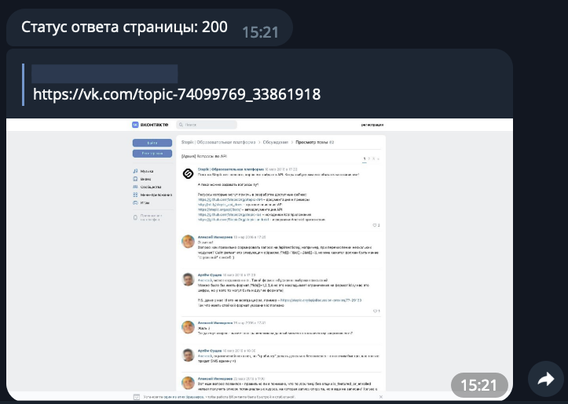

# Screenshot Bot

[](https://www.python.org/)

Telegram - бот, для получения скриншотов страниц сайтов.

## Описание

Бот получает от пользователя ссылку, переходит по ней и делает скриншот страницы и сохраняет код ответа страницы. Полученный скриншот и код страницы отправляется обратно пользователю в Телеграм.

Пример ответа screenshot bot:



Формат сохраняемого файла: «YYYY-MM-DD_HH:mm_<link>.jpg», где:

* YYYY — год, четыре знака,
* MM — месяц, два знака,
* DD — день, два знака,
* HH — часы, 24 часовой формат, два знака,
* mm — минуты, два знака,
* \<link> — ссылка, присланная пользователем.

## Установка

1. Клонировать репозиторий:

    ```python
    https://github.com/egorcoders/screenshot_bot
    ```

2. Перейти в папку с проектом:

    ```python
    cd screenshot_bot/
    ```

3. Установить виртуальное окружение для проекта:

    ```python
    python3 -m venv venv
    ```

4. Активировать виртуальное окружение для проекта:

    ```python
    # для OS Lunix и MacOS
    source venv/bin/activate

    # для OS Windows
    source venv/Scripts/activate
    ```

5. Установить зависимости:

    ```python
    python3 -m pip install --upgrade pip
    pip install -r requirements.txt
    ```

6. Зарегистрировать чат-бота в Телеграм и получить значения переменных окружения API_ID, API_HASH и BOT_TOKEN.

7. Создать в корневой директории файл .env для хранения переменных окружения

   ```python
   API_ID=***
   API_HASH=***
   BOT_TOKEN=***
   DIRECTORY_PATH="screenshots/"
   ```

8. Запустить проект локально:

    ```python
    # для OS Lunix и MacOS
    python main.py

    # для OS Windows
    python3 main.py
    ```

9. Для активации бота, необходимо добавить его и выполнить команду '/start'. Для получения скриншотов, необходимо ввести тест ссылки в чат бота.
